<div align="center">



### `> Still debugging life, one commit at a time.`

**systems architecture · security · automation · AI · building**

<br>

<a href="https://github.com/neminorniel24-droid?tab=repositories">PROJECTS</a>
&nbsp; • &nbsp;
<a href="https://github.com/neminorniel24-droid?tab=activity">ACTIVITY</a>
&nbsp; • &nbsp;
<a href="https://github.com/neminorniel24-droid">GITHUB</a>

</div>

---

## `SYSTEM STATUS`

```text
[ ONLINE ]  systems
[ ACTIVE ]  security research
[ BUILD  ]  automation + AI
[ SHIP   ]  open-source experiments
```

### `CURRENT MODE`

> Build useful things. Break assumptions. Secure what matters. Ship the fix.

<details>
<summary><b>NETWORK MAP</b></summary>

The animated graph above is intentionally built as an SVG rather than a static screenshot.  
The nodes, travelling packets, spider core and activity signal animate inside the README.

</details>

<div align="center">

`████████████████████████████████████████` **SYSTEMS ONLINE**

</div>
