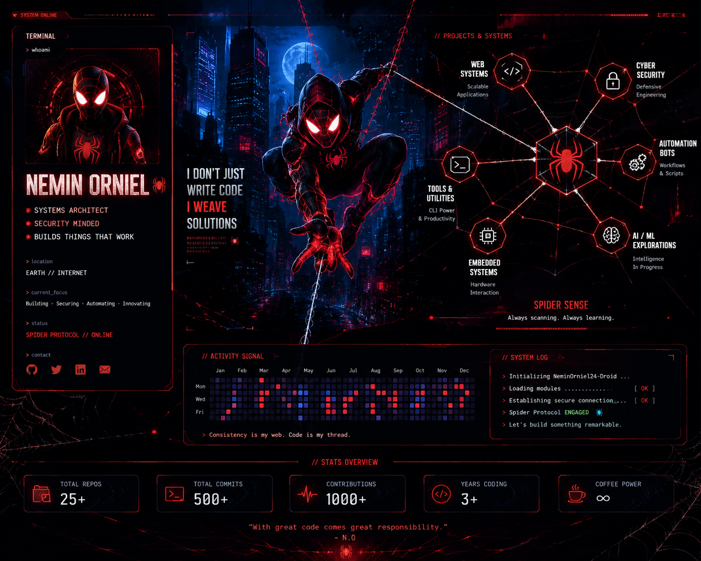

<div align="center">



</div>

## `SYSTEM / NEMIN ORNIEL`

```text
systems architecture   security   automation   AI/ML   hardware
```

I build software and systems, experiment with security, and turn ideas into working projects.

### `NOW`

```text
● online

projects        → building
security        → researching
automation      → shipping
experiments     → running
```

### `ACTIVITY`

[](https://git.io/streak-stats)

<div align="center">

<a href="https://github.com/neminorniel24-droid?tab=repositories">
  
</a>
<a href="https://github.com/neminorniel24-droid?tab=activity">
  
</a>

</div>

---

<div align="center">

`WEB / SYSTEMS / SECURITY / BUILD`

</div>
